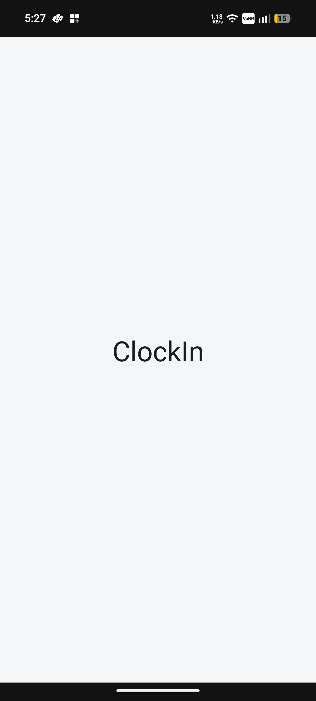
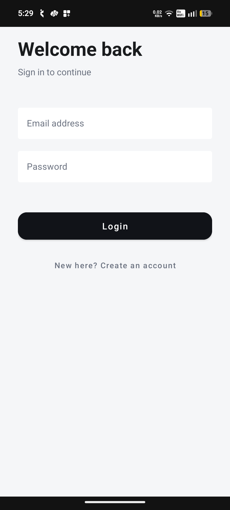
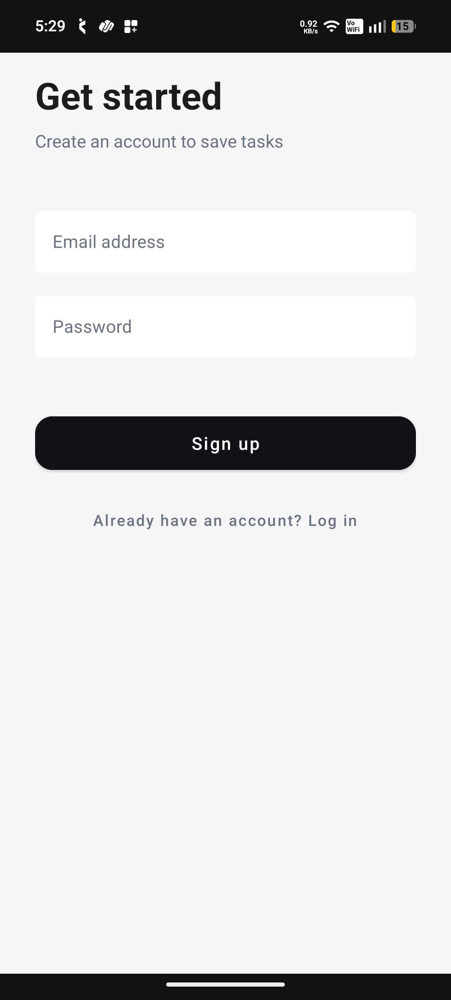
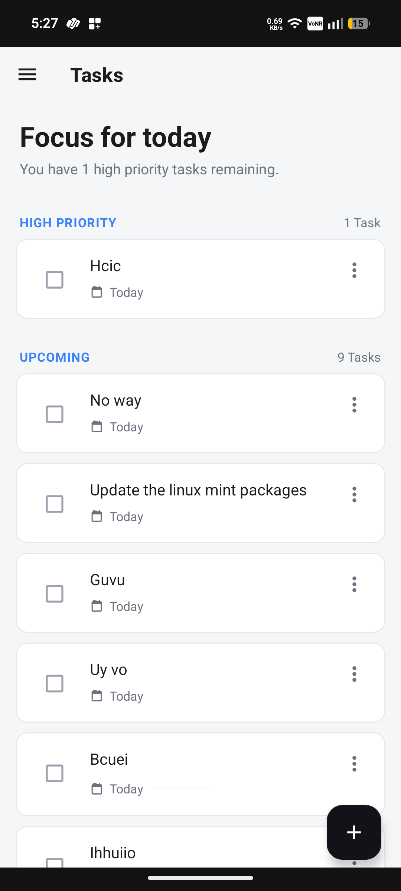
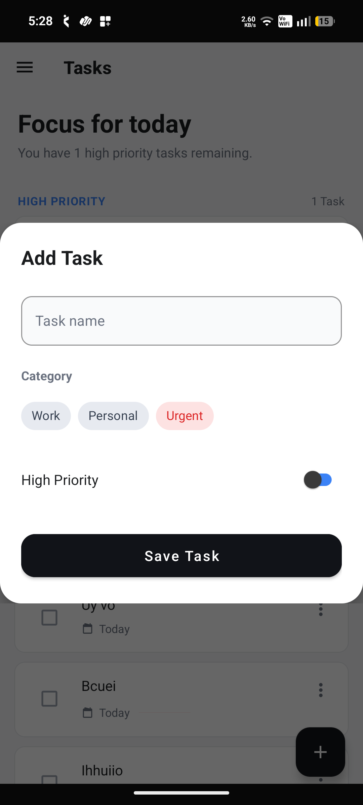

# ⏰ ClockIn – Personal Task Manager Android App

---

## 🚀 Overview

**ClockIn** is a modern personal productivity Android application that helps users stay on top of their day with a focused, priority-driven task list.

Built with **classic Android Views + ViewBinding** and a **local Firebase-emulator REST backend**, the app is designed to be **simple, scalable, and production-ready**.

🎯 **Vision:**

> "Clock in to your day — track tasks, focus on what matters, and never miss a high-priority deadline."

---

## 📸 Screenshots

<div style="overflow-x:auto; padding:8px 2px;">
  <table>
    <tr>
      <td align="center"><br/><sub>Splash</sub></td>
      <td align="center"><br/><sub>Login</sub></td>
      <td align="center"><br/><sub>Signup</sub></td>
      <td align="center"><br/><sub>Home</sub></td>
      <td align="center"><br/><sub>Add Task</sub></td>
    </tr>
  </table>
</div>

---

## ✨ Key Features

### 🔐 Authentication & Startup Flow

- Firebase Auth (email/password login + signup)
- Cold-start Splash screen with one-shot routing (Tasks if logged in, else Login)
- Pure logout interceptor (`AuthStateListener`) that redirects to Login when the user becomes `null`
- Drawer locked on auth/splash flow, unlocked on main screens

### ✅ Task Management System

- Create, edit, delete, and complete tasks
- Tags (`Urgent` / `Work` / `Personal`) and priority (`HIGH` / `NORMAL`)
- Checkbox toggle for completion with instant sync
- Empty-state, loading, and error (Snackbar) UI states

### 🎯 Priority-Based Task List

- Tasks split into **High Priority** and **Upcoming** sections
- In-memory filtering of completed tasks in the ViewModel
- Sectioned `RecyclerView` with header + task rows via a single `TasksAdapter`

### 🧭 Navigation & App Shell

- Single-Activity + `DrawerLayout` architecture
- All screen changes go through a central `Navigator`
- Destinations: `Splash`, `Login`, `Signup`, `Tasks`, `About`
- Navigation drawer with Tasks / About top-level destinations
- Edge-to-edge layout with toolbar state managed per top fragment

### ⚡ Data & Performance

- REST API (Express backend in `functions/`, Firestore Admin on `users/{userId}/tasks/{taskId}`)
- Plain dataclass model (`domain/Task` with defaults; Moshi ignores unknown fields)
- Hilt DI with real REST-backed repositories (`RepositoryModule`)
- Coroutines (`kotlinx-coroutines-android`) for all network calls
- Timber logging (never `android.util.Log`)

---

## 🛠️ Tech Stack

### 📱 Android Development

- Kotlin (100%)
- Android Views + ViewBinding
- Material Components (M2 – `Theme.MaterialComponents.*`)

### 🧠 Architecture

- MVVM (Fragment → ViewModel → Repository)
- Repository Pattern
- Single-Activity + custom `Navigator` / `Destination` navigation

### 🌐 Data Layer

- Retrofit + Moshi + OkHttp (`TaskApi` / `AuthApi`, DTOs with `toDomain()`)
- Hilt DI (`NetworkModule`, `RepositoryModule`)
- Plain `domain/Task` dataclass; backend normalizes dates to millis in `toTaskDto`

### 🔧 Tooling

- AGP 9.3.1, Gradle 9.5.0 (Wrapper), JDK 21 (Build), Java 11 (Source/Target)
- minSdk 24, compileSdk/targetSdk 37
- Timber, Coroutines, ViewBinding, BuildConfig

---

## 📂 Project Architecture

```
com.narang.clockin
│
├── data/
│   ├── TaskApi.kt / AuthApi.kt  # Retrofit contracts
│   ├── TaskDto.kt / AuthDto.kt  # Moshi DTOs + toDomain()
│   ├── TaskRepositoryImpl.kt    # REST impl
│   ├── AuthRepositoryImpl.kt    # REST impl
│   └── AuthInterceptor.kt
│
├── domain/
│   ├── Task.kt                  # plain Parcelable dataclass with defaults
│   ├── AuthUser.kt / Result.kt
│   └── TaskRepository.kt / AuthRepository.kt
│
├── di/
│   ├── NetworkModule.kt         # Moshi + OkHttp + Retrofit + APIs
│   └── RepositoryModule.kt      # provides real impls
│
├── navigation/
│   ├── Destination.kt
│   ├── Destinations.kt              # Splash/Login/Signup/Tasks/About
│   └── Navigator.kt                 # navigate() + navigateToRoot()
│
├── ui/
│   ├── splash/
│   │   └── SplashFragment.kt
│   ├── auth/
│   │   ├── LoginFragment.kt
│   │   ├── SignupFragment.kt
│   │   ├── AuthUiState.kt
│   ├── viewmodel/
│   │   ├── AuthViewModel.kt (@HiltViewModel)
│   │   └── TaskViewModel.kt (@HiltViewModel)
│   ├── tasks/
│   │   ├── TaskFragment.kt          # RecyclerView + FAB + menu dialog
│   │   ├── AddTaskDialogFragment.kt # create/edit sheet
│   │   ├── TaskUiState.kt
│   ├── adapter/
│   │   └── TaskAdapter.kt / TaskListItem.kt
│   └── about/
│       └── AboutFragment.kt
│
├── MainActivity.kt                  # Drawer + toolbar state + splash router + logout guard
├── ClockInApplication.kt            # Timber init
└── MainActivity layout (activity_main.xml, fragment_tasks.xml, drawer menu)
```

## 🧠 Architecture Flow

```
UI (Fragments + ViewBinding)
        ↓
ViewModel (StateFlow<TaskUiState> / AuthUiState)
        ↓
Repository Layer (TaskRepository / AuthRepository REST impls)
        ↓
Remote Data Source (REST API: tasks + auth endpoints)
        ↓
UI State Updates (render() + Snackbar / empty / loading states)
```

## 🎯 Core Modules

### 🏠 Tasks Module

- Priority-grouped task browsing system
- Add/edit dialog with date-time picker, tag, and priority
- Overflow menu (edit/delete) per task row

### 🔎 Auth Module

- Login/signup with form validation and error states
- Auth ViewModel backed by `AuthRepository` (REST)
- Automatic session restore on cold start

### ℹ️ About Module

- Static info screen reachable from the drawer
- Version + app description

---

## ⚙️ Setup Instructions

### 1. Clone the Repository

```
git clone <your-repo-url>
cd ClockIn
```

### 2. Open in Android Studio

- Open the project folder
- Use JDK 21 (Gradle toolchain is managed)
- Wait for Gradle sync (Gradle Wrapper 9.5.0, AGP 9.3.1)

### 3. Start the local backend (Firebase emulators — no cloud project needed)

This project uses **only** the local Firebase emulators as its HTTP server. No Firebase console project, no `google-services.json`, no cloud billing — the app talks to the Functions emulator on your laptop's LAN IP (`NetworkModule.BASE_URL`).

- Install the Firebase CLI, then start Auth + Firestore + Functions with persisted seed data:
  ```
  JAVA_TOOL_OPTIONS="-Xmx512m" firebase emulators:start --only auth,firestore,functions --import=./emulator-data --export-on-exit=./emulator-data
  ```
- Demo login: `demo@clockin.app` / `demo1234` (seeded in `emulator-data/`, gitignored).
- **If the laptop's IP changes** (e.g. phone hotspot instead of home Wi-Fi), update `NetworkModule.BASE_URL` and rebuild — hotspot subnets are usually `192.168.43.x` (Android) or `172.20.10.x` (iPhone).

### 4. Build & Run

```
./gradlew assembleDebug
```

Useful commands:

```
./gradlew testDebugUnitTest          # JVM unit tests (incl. TaskDto mapping)
./gradlew connectedDebugAndroidTest  # instrumented tests
./gradlew lint                       # Android lint
./gradlew check                      # full check
```

---

## 📈 Future Enhancements

- 🔔 Due-date reminders / notifications
- 🔍 Search, tag filter, and sort options
- 📶 Offline persistence + sync status indicator
- ⭐ Recurring tasks and subtasks
- 📊 Productivity stats (completed per day/week)
- 🌙 Dark theme + dynamic color support
- 🧩 Home-screen widget for high-priority tasks

---

## 🏆 Project Highlights

- ✔ Production-style single-Activity + Navigator navigation
- ✔ Realtime per-user Firestore task sync
- ✔ Defensive schema-less model (old/new doc versions coexist)
- ✔ No compound index needed (single-field `orderBy`, in-memory filter)
- ✔ Clean MVVM + Repository separation, ViewBinding-only views
- ✔ Unit-tested model layer (`TaskFromDocumentTest`)

---

## 👨‍💻 Developer

**ClockIn** – Android (Kotlin, Views, Firebase) task manager.

---

## 📌 License

This project is for educational and portfolio purposes only.

---

## 🚀 Final Note

ClockIn is a focused, local-backend (Firebase emulators) productivity app concept designed to grow into a full daily-planning product with reminders, offline-first sync, and smart prioritization.
